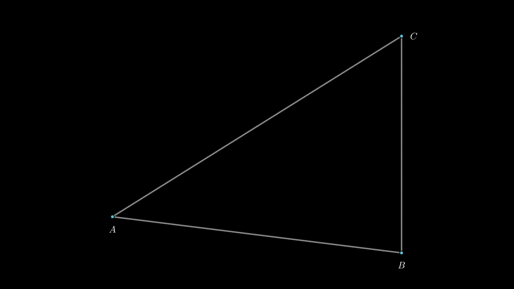

# manim_linalg


```python
from utils_2D import *

dot_kwargs = {"radius": 0.05, "fill_color": BLUE, "stroke_color": BLACK, "stroke_width": 2, "z_index": 1}
tex_kwargs = {"font_size": 25, "z_index": 1}
line_kwargs = {"stroke_color": GREY, "stroke_opacity": 1, "stroke_width": 4, "z_index": 0}


class BasicTriangle(MovingCameraScene):
    def construct(self):
        A = np.array([-4, -2, 0])
        B = np.array([4, -3, 0])
        C = np.array([4, 3, 0])

        A_dot = Dot(**dot_kwargs).move_to(A)
        B_dot = Dot(**dot_kwargs).move_to(B)
        C_dot = Dot(**dot_kwargs).move_to(C)

        A_tex = Tex("A", **tex_kwargs).next_to(A, DOWN)
        B_tex = Tex("B", **tex_kwargs).next_to(B, DOWN)
        C_tex = Tex("C", **tex_kwargs).next_to(C, RIGHT)

        triangleE2 = TriangleE2(A=A[0:2], B=B[0:2], C=C[0:2])  # utils_2D.TriangleE2
        AB_line = triangleE2.AB.get_Line(**line_kwargs)
        BC_line = triangleE2.BC.get_Line(**line_kwargs)
        AC_line = triangleE2.AC.get_Line(**line_kwargs)

        self.play(AnimationGroup(DrawBorderThenFill(A_dot), DrawBorderThenFill(B_dot),
                                 DrawBorderThenFill(C_dot)))
        self.play(AnimationGroup(Write(A_tex), Write(B_tex), Write(C_tex)))
        self.play(AnimationGroup(Create(AB_line), Create(BC_line), Create(AC_line)))
        self.wait()
        self.play(FadeOut(*self.mobjects))
```

```python
from utils_2D import *

dot_kwargs = {"radius": 0.05, "fill_color": BLUE, "stroke_color": BLACK, "stroke_width": 2, "z_index": 1}
tex_kwargs = {"font_size": 25, "z_index": 1}
line_kwargs = {"stroke_color": GREY, "stroke_opacity": 1, "stroke_width": 4, "z_index": 0}
moving_dot_kwargs = {"radius": 0.05, "fill_color": YELLOW, "stroke_color": BLACK, "stroke_width": 2, "z_index": 1}
dash_kwargs = {"stroke_opacity": 1, "stroke_width": 2.5, "z_index": 1}


class Median(MovingCameraScene):
    def construct(self):
        A = np.array([-4, -2, 0])
        B = np.array([4, -3, 0])
        C = np.array([4, 3, 0])

        A_dot = Dot(**dot_kwargs).move_to(A)
        B_dot = Dot(**dot_kwargs).move_to(B)
        C_dot = Dot(**dot_kwargs).move_to(C)

        A_tex = MathTex("A", **tex_kwargs).next_to(A, DOWN)
        B_tex = MathTex("B", **tex_kwargs).next_to(B, DOWN)
        C_tex = MathTex("C", **tex_kwargs).next_to(C, RIGHT)

        triangleE2 = TriangleE2(A=A[0:2], B=B[0:2], C=C[0:2])  # utils_2D.TriangleE2
        AB_line = triangleE2.AB.get_Line(**line_kwargs)
        BC_line = triangleE2.BC.get_Line(**line_kwargs)
        AC_line = triangleE2.AC.get_Line(**line_kwargs)

        # Медианы треугольника ▲ABC из вершины A, B, C ↓
        median_A = triangleE2.median(A_dot.get_center()[0:2])  # utils_2D.LineE2
        median_B = triangleE2.median(B_dot.get_center()[0:2])  # utils_2D.LineE2
        median_C = triangleE2.median(C_dot.get_center()[0:2])  # utils_2D.LineE2
        centroid = triangleE2.centroid

        median_A_line = median_A.get_Line(**line_kwargs)
        median_B_line = median_B.get_Line(**line_kwargs)
        median_C_line = median_C.get_Line(**line_kwargs)
        centroid_dot = Dot(**moving_dot_kwargs).move_to(LineE2.make_R3(centroid))

        M1_dot = Dot(**moving_dot_kwargs).move_to(median_A.end_manim)
        M1_tex = MathTex("M_1", **tex_kwargs).next_to(M1_dot, RIGHT)
        M2_dot = Dot(**moving_dot_kwargs).move_to(median_B.end_manim)
        M2_tex = MathTex("M_2", **tex_kwargs).next_to(M2_dot, UP)
        M3_dot = Dot(**moving_dot_kwargs).move_to(median_C.end_manim)
        M3_tex = MathTex("M_3", **tex_kwargs).next_to(M3_dot, DOWN)

        # Отрезки сторон
        BM1 = LineE2(B_dot.get_center()[0:2], median_A.end_point)
        dash_BM1 = BM1.line_by_angle(angle=PI/2, start_point=BM1.center, length_scale=0.2).get_Line(stroke_color=BLUE, **dash_kwargs).move_to(LineE2.make_R3(BM1.center))

        M1C = LineE2(median_A.end_point, C_dot.get_center()[0:2])
        dash_M1C = M1C.line_by_angle(angle=PI/2, start_point=M1C.center, length_scale=0.2).get_Line(stroke_color=BLUE, **dash_kwargs).move_to(LineE2.make_R3(M1C.center))

        CM2 = LineE2(C_dot.get_center()[0:2], median_B.end_point)
        dash_CM2 = CM2.line_by_angle(angle=PI/2, start_point=CM2.center, length_scale=0.2).get_Line(stroke_color=YELLOW, **dash_kwargs).move_to(LineE2.make_R3(CM2.center))

        M2A = LineE2(median_B.end_point, A_dot.get_center()[0:2])
        dash_M2A = M2A.line_by_angle(angle=PI/2, start_point=M2A.center, length_scale=0.2).get_Line(stroke_color=YELLOW, **dash_kwargs).move_to(LineE2.make_R3(M2A.center))

        AM3 = LineE2(A_dot.get_center()[0:2], median_C.end_point)
        dash_AM3 = AM3.line_by_angle(angle=PI/2, start_point=AM3.center, length_scale=0.2).get_Line(stroke_color=PURE_MAGENTA, **dash_kwargs).move_to(LineE2.make_R3(AM3.center))

        M3B = LineE2(median_C.end_point, B_dot.get_center()[0:2])
        dash_M3B = M3B.line_by_angle(angle=PI/2, start_point=M3B.center, length_scale=0.2).get_Line(stroke_color=PURE_MAGENTA, **dash_kwargs).move_to(LineE2.make_R3(M3B.center))

        self.add(A_dot, B_dot, C_dot, A_tex, B_tex, C_tex, AB_line, BC_line, AC_line)
        self.wait()

        self.play(AnimationGroup(DrawBorderThenFill(M1_dot), Write(M1_tex)))
        self.play(Create(median_A_line))
        self.play(AnimationGroup(Create(dash_BM1), Create(dash_M1C)))

        self.play(AnimationGroup(DrawBorderThenFill(M2_dot), Write(M2_tex)))
        self.play(Create(median_B_line))
        self.play(AnimationGroup(Create(dash_CM2), Create(dash_M2A)))

        self.play(AnimationGroup(DrawBorderThenFill(M3_dot), Write(M3_tex)))
        self.play(Create(median_C_line))
        self.play(AnimationGroup(Create(dash_AM3), Create(dash_M3B)))

        self.play(DrawBorderThenFill(centroid_dot))
        self.wait()
        self.play(FadeOut(*self.mobjects))
```


```python
from utils_2D import *

dot_kwargs = {"radius": 0.05, "fill_color": BLUE, "stroke_color": BLACK, "stroke_width": 2, "z_index": 1}
tex_kwargs = {"font_size": 25, "z_index": 1}
line_kwargs = {"stroke_color": GREY, "stroke_opacity": 1, "stroke_width": 4, "z_index": 0}
moving_dot_kwargs = {"radius": 0.05, "fill_color": YELLOW, "stroke_color": BLACK, "stroke_width": 2, "z_index": 1}
angle_kwargs = {"stroke_color": BLUE, "stroke_opacity": 0.8, "stroke_width": 2.5, "z_index": -1}


class Height(MovingCameraScene):
    def construct(self):
        A = np.array([-4, -2, 0])
        B = np.array([4, -3, 0])
        C = np.array([4, 3, 0])

        A_dot = Dot(**dot_kwargs).move_to(A)
        B_dot = Dot(**dot_kwargs).move_to(B)
        C_dot = Dot(**dot_kwargs).move_to(C)

        A_tex = MathTex("A", **tex_kwargs).next_to(A, DOWN)
        B_tex = MathTex("B", **tex_kwargs).next_to(B, DOWN)
        C_tex = MathTex("C", **tex_kwargs).next_to(C, RIGHT)

        triangleE2 = TriangleE2(A=A[0:2], B=B[0:2], C=C[0:2])  # utils_2D.TriangleE2
        AB_line = triangleE2.AB.get_Line(**line_kwargs)
        BC_line = triangleE2.BC.get_Line(**line_kwargs)
        AC_line = triangleE2.AC.get_Line(**line_kwargs)

        # Высоты треугольника ▲ABC из вершины A, B, C ↓
        height_A = triangleE2.height(A_dot.get_center()[0:2])  # utils_2D.LineE2
        height_B = triangleE2.height(B_dot.get_center()[0:2])  # utils_2D.LineE2
        height_C = triangleE2.height(C_dot.get_center()[0:2])  # utils_2D.LineE2
        orthocenter = triangleE2.orthocenter

        height_A_line = height_A.get_Line(**line_kwargs)
        height_B_line = height_B.get_Line(**line_kwargs)
        height_C_line = height_C.get_Line(**line_kwargs)
        orthocenter_dot = Dot(**moving_dot_kwargs).move_to(LineE2.make_R3(orthocenter))

        H1_dot = Dot(**moving_dot_kwargs).move_to(height_A.end_manim)
        H1_tex = MathTex("H_1", **tex_kwargs).next_to(H1_dot, RIGHT)
        H2_dot = Dot(**moving_dot_kwargs).move_to(height_B.end_manim)
        H2_tex = MathTex("H_2", **tex_kwargs).next_to(H2_dot, UP)
        H3_dot = Dot(**moving_dot_kwargs).move_to(height_C.end_manim)
        H3_tex = MathTex("H_3", **tex_kwargs).next_to(H3_dot, DOWN)

        # Отрезки сторон
        # BH1 = LineE2(B_dot.get_center()[0:2], height_A.end_point)
        H1C = LineE2(height_A.end_point, C_dot.get_center()[0:2])
        right_angle_1 = RightAngle(H1C.get_Line(), height_A_line, length=0.2, **angle_kwargs, quadrant=(-1, -1))

        # CH2 = LineE2(C_dot.get_center()[0:2], height_B.end_point)
        H2A = LineE2(height_B.end_point, A_dot.get_center()[0:2])
        right_angle_2 = RightAngle(H2A.get_Line(), height_B_line, length=0.2, **angle_kwargs, quadrant=(-1, -1))

        # AH3 = LineE2(A_dot.get_center()[0:2], height_C.end_point)
        H3B = LineE2(height_C.end_point, B_dot.get_center()[0:2])
        right_angle_3 = RightAngle(H3B.get_Line(), height_C_line, length=0.2, **angle_kwargs, quadrant=(-1, -1))

        self.add(A_dot, B_dot, C_dot, A_tex, B_tex, C_tex, AB_line, BC_line, AC_line)
        self.wait()

        self.play(AnimationGroup(DrawBorderThenFill(H1_dot), Write(H1_tex)))
        self.play(Create(height_A_line))
        self.play(Create(right_angle_1))

        self.play(AnimationGroup(DrawBorderThenFill(H2_dot), Write(H2_tex)))
        self.play(Create(height_B_line))
        self.play(Create(right_angle_2))

        self.play(AnimationGroup(DrawBorderThenFill(H3_dot), Write(H3_tex)))
        self.play(Create(height_C_line))
        self.play(Create(right_angle_3))

        self.play(DrawBorderThenFill(orthocenter_dot))
        self.wait()
        self.play(FadeOut(*self.mobjects))
```

```python
from utils_2D import *

dot_kwargs = {"radius": 0.05, "fill_color": BLUE, "stroke_color": BLACK, "stroke_width": 2, "z_index": 1}
tex_kwargs = {"font_size": 25, "z_index": 1}
line_kwargs = {"stroke_color": GREY, "stroke_opacity": 1, "stroke_width": 4, "z_index": 0}
angle_kwargs_an = {"stroke_opacity": 0.8, "stroke_width": 2.5, "z_index": -1}
moving_dot_kwargs = {"radius": 0.05, "fill_color": YELLOW, "stroke_color": BLACK, "stroke_width": 2, "z_index": 1}
circle_kwargs = {"stroke_color": PURE_MAGENTA, "stroke_opacity": 1, "stroke_width": 2.5, "z_index": -2}


class Bisector(MovingCameraScene):
    def construct(self):
        A = np.array([-4, -2, 0])
        B = np.array([4, -3, 0])
        C = np.array([4, 3, 0])

        A_dot = Dot(**dot_kwargs).move_to(A)
        B_dot = Dot(**dot_kwargs).move_to(B)
        C_dot = Dot(**dot_kwargs).move_to(C)

        A_tex = always_redraw(lambda: MathTex("A", **tex_kwargs).next_to(A_dot.get_center(), DOWN))
        B_tex = always_redraw(lambda: MathTex("B", **tex_kwargs).next_to(B_dot.get_center(), DOWN))
        C_tex = always_redraw(lambda: MathTex("C", **tex_kwargs).next_to(C_dot.get_center(), RIGHT))

        AB_line = always_redraw(lambda: self.triangleE2(A_dot, B_dot, C_dot).AB.get_Line(**line_kwargs))
        BC_line = always_redraw(lambda: self.triangleE2(A_dot, B_dot, C_dot).BC.get_Line(**line_kwargs))
        AC_line = always_redraw(lambda: self.triangleE2(A_dot, B_dot, C_dot).AC.get_Line(**line_kwargs))

        bisector_A = always_redraw(lambda: self.triangleE2(A_dot, B_dot, C_dot).bisector(A_dot.get_center()[0:2]).get_Line(**line_kwargs))
        I1 = always_redraw(lambda: Dot(**dot_kwargs).move_to(bisector_A.get_end()))
        I1_tex = always_redraw(lambda: MathTex("I_1", **tex_kwargs).next_to(I1, RIGHT))
        angle_A1 = always_redraw(lambda: Angle(bisector_A, AC_line, radius=1, stroke_color=BLUE, **angle_kwargs_an))
        angle_A2 = always_redraw(lambda: Angle(AB_line, bisector_A, radius=1, stroke_color=BLUE, **angle_kwargs_an))

        bisector_B = always_redraw(lambda: self.triangleE2(A_dot, B_dot, C_dot).bisector(B_dot.get_center()[0:2]).get_Line(**line_kwargs))
        I2 = always_redraw(lambda: Dot(**dot_kwargs).move_to(bisector_B.get_end()))
        I2_tex = always_redraw(lambda: MathTex("I_2", **tex_kwargs).next_to(I2, UP))
        angle_B1 = always_redraw(lambda: Angle(BC_line, bisector_B, radius=1, stroke_color=YELLOW, **angle_kwargs_an))
        angle_B2 = always_redraw(lambda: Angle(bisector_B, AB_line, radius=1, stroke_color=YELLOW, **angle_kwargs_an, quadrant=(1, -1) ))

        bisector_C = always_redraw(lambda: self.triangleE2(A_dot, B_dot, C_dot).bisector(C_dot.get_center()[0:2]).get_Line(**line_kwargs))
        I3 = always_redraw(lambda: Dot(**dot_kwargs).move_to(bisector_C.get_end()))
        I3_tex = always_redraw(lambda: MathTex("I_3", **tex_kwargs).next_to(I3, DOWN))
        angle_C1 = always_redraw(lambda: Angle(AC_line, bisector_C, radius=1, stroke_color=PURE_MAGENTA, **angle_kwargs_an, quadrant=(-1, 1) ))
        angle_C2 = always_redraw(lambda: Angle(bisector_C, BC_line, radius=1, stroke_color=PURE_MAGENTA, **angle_kwargs_an, quadrant=(1, -1) ))

        moving_dot = Dot(**dot_kwargs).move_to(B_dot.get_center())
        A_moving_line = always_redraw(lambda: Line(A_dot.get_center(), moving_dot.get_center(), **line_kwargs))

        self.add(A_dot, B_dot, C_dot, A_tex, B_tex, C_tex, AB_line, BC_line, AC_line)
        self.wait()

        self.add(moving_dot, A_moving_line)
        self.play(moving_dot.animate.move_to(bisector_A.get_end()))
        self.add(bisector_A, I1)
        self.play(AnimationGroup(Create(angle_A1), Create(angle_A2), Write(I1_tex)))
        self.remove(moving_dot, A_moving_line)

        moving_dot.move_to(C_dot.get_center())
        B_moving_line = always_redraw(lambda: Line(B_dot.get_center(), moving_dot.get_center(), **line_kwargs))

        self.add(moving_dot, B_moving_line)
        self.play(moving_dot.animate.move_to(bisector_B.get_end()))
        self.add(bisector_B, I2)
        self.play(Create(angle_B1), Create(angle_B2), Write(I2_tex))
        self.remove(moving_dot, B_moving_line)

        moving_dot.move_to(A_dot.get_center())
        C_moving_line = always_redraw(lambda: Line(C_dot.get_center(), moving_dot.get_center(), **line_kwargs))

        self.add(moving_dot, C_moving_line)
        self.play(moving_dot.animate.move_to(bisector_C.get_end()))
        self.add(bisector_C, I3)
        self.play(Create(angle_C1), Create(angle_C2), Write(I3_tex))
        self.remove(moving_dot, C_moving_line)

        incenter_dot = always_redraw(lambda: Dot(point=LineE2.make_R3(self.triangleE2(A_dot, B_dot, C_dot).incenter), **moving_dot_kwargs))
        self.play(DrawBorderThenFill(incenter_dot))

        inscribed_circle = always_redraw(lambda: Circle(radius=self.triangleE2(A_dot, B_dot, C_dot).inscribed_radius, **circle_kwargs).move_to(incenter_dot))
        self.play(FadeIn(inscribed_circle))

        self.play(A_dot.animate.shift(5*UP), run_time=2)
        self.play(A_dot.animate.shift(5*DOWN), run_time=2)

        self.play(B_dot.animate.shift(2 * UP + 3 * RIGHT), run_time=2)
        self.play(B_dot.animate.shift(2 * DOWN + 3 * LEFT), run_time=2)

        self.play(C_dot.animate.shift(5*LEFT), run_time=2)
        self.play(C_dot.animate.shift(5*RIGHT), run_time=2)

        self.wait()
        self.play(FadeOut(*self.mobjects))

    @staticmethod
    def triangleE2(A_dot: Dot, B_dot: Dot, C_dot: Dot):
        return TriangleE2(A=A_dot.get_center()[0:2], B=B_dot.get_center()[0:2], C=C_dot.get_center()[0:2])
```