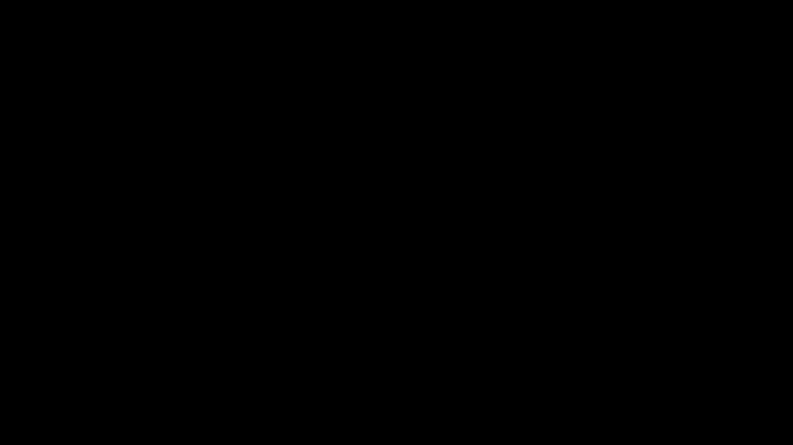

# manim_linalg


```python
from manim import *
from utils_2D import *
class Intersection_Scene(Scene):
    def construct(self):
        dot_kwargs = {"radius": 0.05, "color": YELLOW, "stroke_color": BLACK, "stroke_width": 2, "z_index": 2}
        line_kwargs = {"fill_color": WHITE, "fill_opacity": 0.6, "stroke_width": 2, "z_index": 1}

        topic = Tex(r"How to find the intersection of two lines?", font_size=40).to_edge(UP)

        A = Dot(np.array([0, 1, 0]), **dot_kwargs)
        B = Dot(np.array([2, -1, 0]), **dot_kwargs)
        C = Dot(np.array([-1, -2, 0]), **dot_kwargs)
        D = Dot(np.array([0, -3, 0]), **dot_kwargs)

        A_tex = MathTex("A", font_size=25).next_to(A, UP)
        B_tex = MathTex("B", font_size=25).next_to(B, RIGHT)
        C_tex = MathTex("C", font_size=25).next_to(C, LEFT)
        D_tex = MathTex("D", font_size=25).next_to(D, RIGHT)

        AD_KV = LineE2(A.get_center(), D.get_center())
        BC_KV = LineE2(B.get_center(), C.get_center())

        intersection = Dot(AD_KV.intersection(BC_KV), **dot_kwargs)
        intersection_tex = MathTex("I", font_size=25).next_to(intersection, RIGHT + 0.5*DOWN)

        code = """
        dot_kwargs = {"radius": 0.05, "color": YELLOW, "stroke_color": BLACK, "stroke_width": 2, "z_index": 2}
        AD_KV = LineE2(np.array([0, 1, 0]), np.array([0, -3, 0]))
        BC_KV = LineE2(np.array([2, -1, 0]), np.array([-1, -2, 0]))
        intersection = Dot(AD_KV.intersection(BC_KV), **dot_kwargs)"""

        rendered_code = Code(code_string=code, language="python", tab_width=4, background="window", formatter_style="github-dark").scale(0.5).next_to(topic, DOWN)

        self.play(Write(topic))
        self.play(AnimationGroup(DrawBorderThenFill(A), DrawBorderThenFill(B), DrawBorderThenFill(C), DrawBorderThenFill(D)))
        self.play(AnimationGroup(Write(A_tex), Write(B_tex), Write(C_tex), Write(D_tex)))
        self.play(AnimationGroup(Create(AD_KV.get_Line(**line_kwargs)), Create(BC_KV.get_Line(**line_kwargs))))
        self.play(Wiggle(topic, run_time=5))
        self.play(Write(rendered_code, run_time=8))
        self.play(TransformFromCopy(rendered_code, intersection))
        self.play(Write(intersection_tex))
        self.wait(2)
        self.play(AnimationGroup(*[FadeOut(mob) for mob in self.mobjects]))


```



```python
from manim import *
from utils_2D import *
class Circles_Scene(Scene):
    def construct(self):
        dot_kwargs = {"radius": 0.05, "color": YELLOW, "stroke_color": BLACK, "stroke_width": 2, "z_index": 2}
        line_kwargs = {"fill_color": WHITE, "fill_opacity": 0.6, "stroke_width": 2, "z_index": 1}
        right_angle_kwargs = {"fill_color": BLACK, "stroke_color": BLUE, "length": 0.2, "stroke_width": 2, "z_index": 0}

        A = Dot(np.array([0, 2, 0]), **dot_kwargs)
        B = Dot(np.array([2, 0, 0]), **dot_kwargs)
        C = Dot(np.array([-1, -1, 0]), **dot_kwargs)
        A_tex = MathTex("A", font_size=25).next_to(A, UP)
        B_tex = MathTex("B", font_size=25).next_to(B, RIGHT)
        C_tex = MathTex("C", font_size=25).next_to(C, LEFT)

        triangle_KV = TriangleE2(A.get_center(), B.get_center(), C.get_center())
        AB_KV = triangle_KV.AB
        BC_KV = triangle_KV.BC
        AC_KV = triangle_KV.AC
        A_height_KV = triangle_KV.height(A.get_center())
        B_height_KV = triangle_KV.height(B.get_center())
        C_height_KV = triangle_KV.height(C.get_center())

        H1 = Dot(A_height_KV.end_manim, **dot_kwargs)
        H2 = Dot(B_height_KV.end_manim, **dot_kwargs)
        H3 = Dot(C_height_KV.end_manim, **dot_kwargs)

        H1_tex = MathTex("H_1", font_size=25).next_to(H1, DOWN)
        H2_tex = MathTex("H_2", font_size=25).next_to(H2, LEFT)
        H3_tex = MathTex("H_3", font_size=25).next_to(H3, RIGHT)

        orthocenter = Dot(triangle_KV.orthocenter, **dot_kwargs)

        AH1C_angle = RightAngle((-A_height_KV).get_Line(), Line(H1.get_center(), C.get_center()), **right_angle_kwargs)
        BH2A_angle = RightAngle((-B_height_KV).get_Line(), Line(H2.get_center(), C.get_center()), **right_angle_kwargs)
        CH3B_angle = RightAngle((-C_height_KV).get_Line(), Line(H3.get_center(), B.get_center()), **right_angle_kwargs)

        self.play(AnimationGroup(DrawBorderThenFill(A), DrawBorderThenFill(B), DrawBorderThenFill(C)))
        self.play(AnimationGroup(Write(A_tex), Write(B_tex), Write(C_tex)))
        self.play(AnimationGroup(Create(AB_KV.get_Line(**line_kwargs)), Create(BC_KV.get_Line(**line_kwargs)), Create(AC_KV.get_Line(**line_kwargs))))
        self.play(AnimationGroup(Create(A_height_KV.get_Line(**line_kwargs)), Create(B_height_KV.get_Line(**line_kwargs)), Create(C_height_KV.get_Line(**line_kwargs))))
        self.play(AnimationGroup(DrawBorderThenFill(H1), DrawBorderThenFill(H2), DrawBorderThenFill(H3), DrawBorderThenFill(orthocenter)))
        self.play(AnimationGroup(Write(H1_tex), Write(H2_tex), Write(H3_tex)))
        self.play(AnimationGroup(Create(AH1C_angle), Create(BH2A_angle), Create(CH3B_angle)))
        self.wait(2)
        self.play(AnimationGroup(*[FadeOut(mob) for mob in self.mobjects]))
```


```python
from manim import *
from utils_2D import *
class Moving_Scene(Scene):
    def construct(self):
        dot_kwargs = {"radius": 0.05, "color": YELLOW, "stroke_color": BLACK, "stroke_width": 2, "z_index": 2}
        line_kwargs = {"fill_color": WHITE, "fill_opacity": 0.6, "stroke_width": 2, "z_index": 1}
        A = Dot(np.array([0, 2, 0]), **dot_kwargs)
        B = Dot(np.array([2, 0, 0]), **dot_kwargs)
        C = Dot(np.array([-1, -1, 0]), **dot_kwargs)

        A_tex = always_redraw(lambda: MathTex("A", font_size=25).next_to(A, UP))
        B_tex = always_redraw(lambda: MathTex("B", font_size=25).next_to(B, RIGHT))
        C_tex = always_redraw(lambda: MathTex("C", font_size=25).next_to(C, LEFT))
        AB = always_redraw(lambda: TriangleE2(A.get_center(), B.get_center(), C.get_center()).AB.get_Line(**line_kwargs))
        BC = always_redraw(lambda: TriangleE2(A.get_center(), B.get_center(), C.get_center()).BC.get_Line(**line_kwargs))
        AC = always_redraw(lambda: TriangleE2(A.get_center(), B.get_center(), C.get_center()).AC.get_Line(**line_kwargs))

        triangle_KV = TriangleE2(A.get_center(), B.get_center(), C.get_center())
        circle_center = triangle_KV.circumscribed_center
        circle_radius = triangle_KV.circumscribed_radius
        circumscribed_circle = Arc(radius=circle_radius, start_angle=PI/2+3*PI/64, angle=TAU, color=BLUE, stroke_width=2, z_index=0).move_to(circle_center)

        self.play(AnimationGroup(DrawBorderThenFill(A), DrawBorderThenFill(B), DrawBorderThenFill(C)))
        self.play(AnimationGroup(Write(A_tex), Write(B_tex), Write(C_tex)))
        self.play(AnimationGroup(Write(AB), Write(BC), Write(AC)))
        self.play(Create(circumscribed_circle))
        self.play(MoveAlongPath(A, circumscribed_circle, run_time=5))
        self.wait(2)
        self.play(AnimationGroup(*[FadeOut(mob) for mob in self.mobjects]))
```